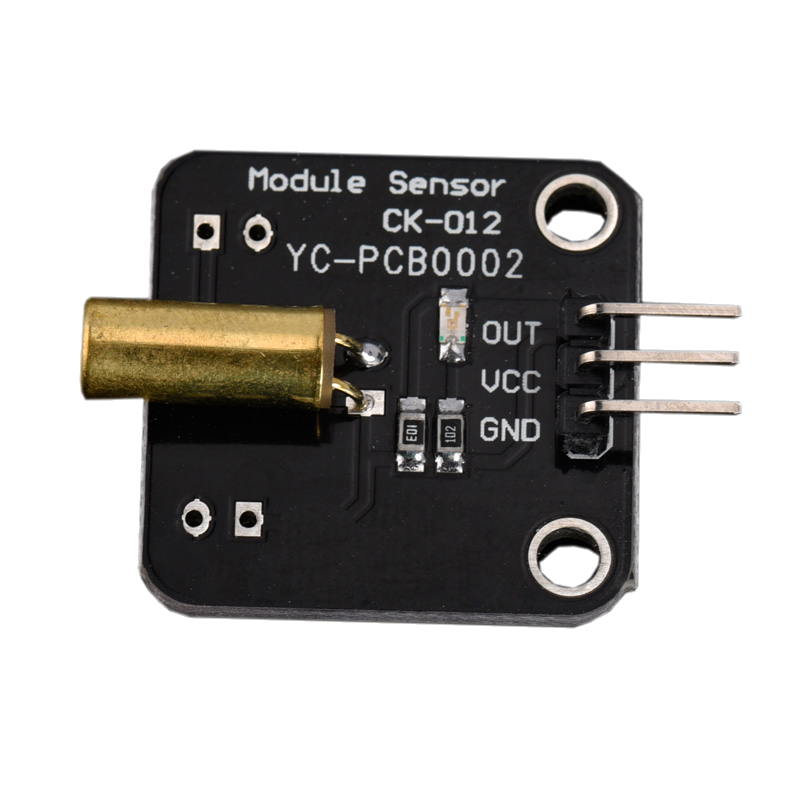

# 滾珠開關模組



## 專案說明

使用「LinkIt 7697 NANO Breakout」連接「滾珠開關模組」， 每0.5秒讀取滾珠開關模組開啟或關閉。
  
此**滾珠開關模組**包含於「[**洞洞么教學材料包**](https://www.robotkingdom.com.tw/product/rk-education-kit-001/) 」內。

## LinkIt 7697 電路圖

**•**	[**LinkIt 7697**
  
](https://www.robotkingdom.com.tw/product/linkit-7697/)**•	LinkIt 7697 NANO Breakout
  
•	滾珠開關模組**

**滾珠開關模組**是**數位**輸入， 可以接「D0 ~ D13」的 LinkIt 7697 NANO Breakout訊號端上。 本範例連接到「**D2**」。


## BlocklyDuino 積木畫布

每0.5秒鐘讀取滾珠開關模組狀態，並顯示在序列埠監控視窗 \(搖動滾珠開關模組時，可以感覺到有滾珠在移動\)。


## Arduino 程式

```text
void setup()
{

  pinMode(2, INPUT);
  Serial.begin(9600);

}


void loop()
{
  Serial.println(digitalRead(2));
  delay(500);
}

```

