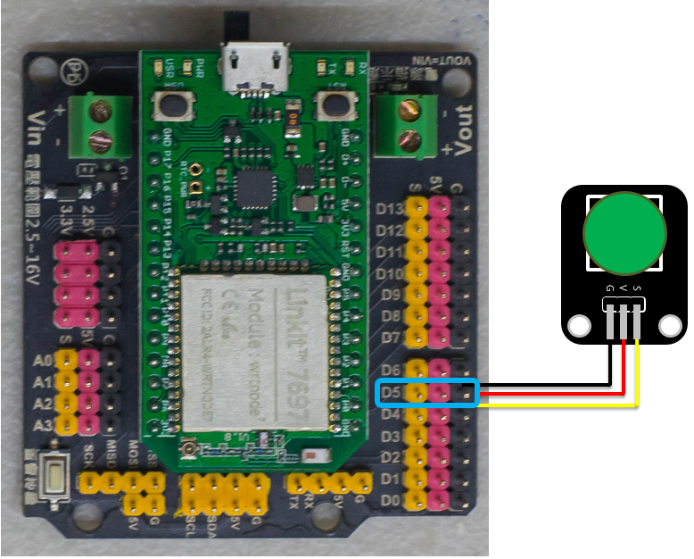
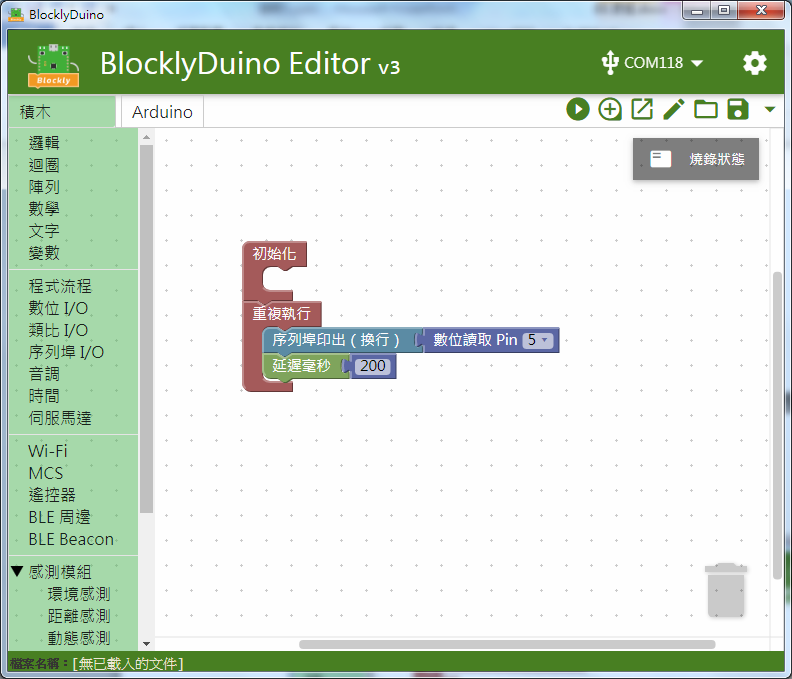
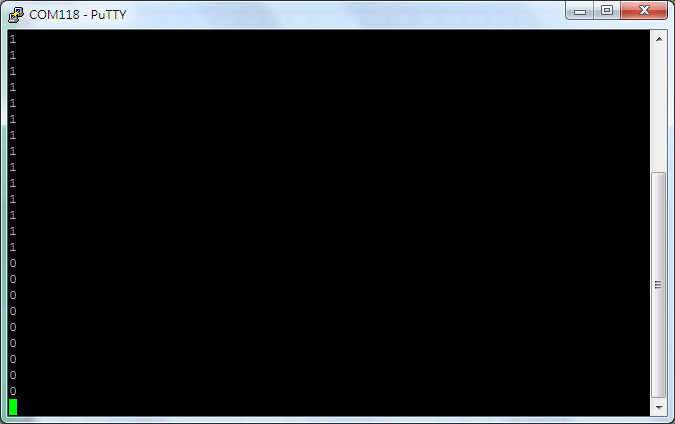

# 按鈕模組

## 專案說明

使用「LinkIt 7697 NANO Breakout」連接「按鈕模組」, 讀取按鈕模組按下或放開的狀態。
  
此**按鈕模組**包含於「**Education Kit for Linkit 7697**」內。
  
-按鈕模組圖-

## 電路圖

**•**	[**LinkIt 7697**
  
](https://www.robotkingdom.com.tw/product/linkit-7697/)**•	LinkIt 7697 NANO Breakout
  
•	按鈕模組**

**按鈕模組**是**數位訊號**輸入， 可以接「D0 ~ D13」的 LinkIt 7697 NANO Breakout訊號端上。 本範例連接到「**D5**」。



## 積木畫布

每0.2秒鐘會讀取按鈕模組狀態一次， 並可透過序列埠監控視窗看到按鈕模組的狀態 。





產生出的 Arduino 程式如下：

```text
void setup()
{

  pinMode(5, INPUT);
  Serial.begin(9600);

}


void loop()
{
  Serial.println(digitalRead(5));
  delay(200);
}

```

