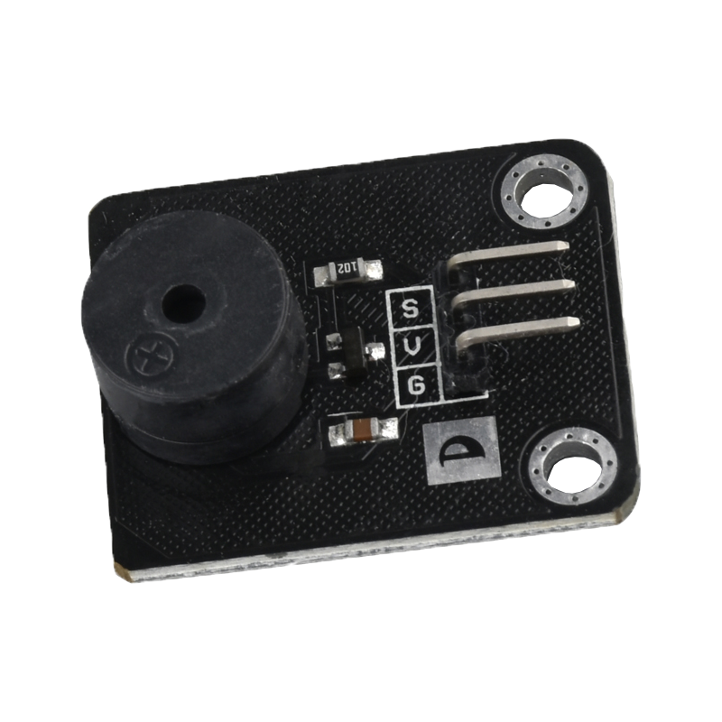
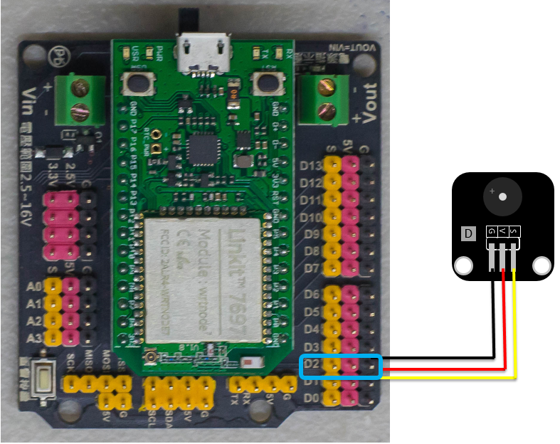
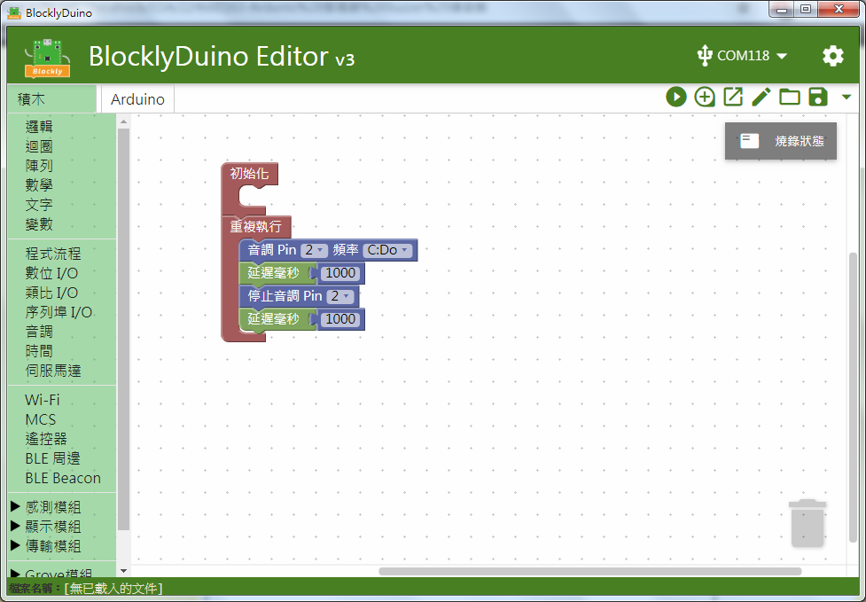

# 無源蜂鳴器模組



## 專案說明

使用「LinkIt 7697 NANO Breakout」連接「無源蜂鳴器模組」， 每一秒控制無源蜂鳴器模組發出「Do」的音階和靜音 。
  
此**無源蜂鳴器模組**包含於「[**洞洞么教學材料包**](https://www.robotkingdom.com.tw/product/rk-education-kit-001/) 」內 。

## LinkIt 7697 電路圖

**•**	[**LinkIt 7697**
  
](https://www.robotkingdom.com.tw/product/linkit-7697/)**•	LinkIt 7697 NANO Breakout
  
•	無源蜂鳴器模組**

**無源蜂鳴器模組**是**脈衝寬度調變\(Pulse Width Modulation\)訊號**輸出， 可以接「D0 ~ D13」的 LinkIt 7697 NANO Breakout訊號端上。 本範例連接到「**D2**」。


蜂鳴器分為「有源蜂鳴器」及「無源蜂鳴器」，「有源蜂鳴器」僅能發出單一頻率的聲音；「無源蜂鳴器」可依據不同的頻率發出不同聲調的聲音。




## BlocklyDuino 積木畫布

每一秒控制無源蜂鳴器模組發出「Do」的音階和靜音。



## Arduino 程式

```text
void setup()
{

}


void loop()
{
  tone(2, 262);
  delay(1000);
  noTone(2);
  delay(1000);
}

```

