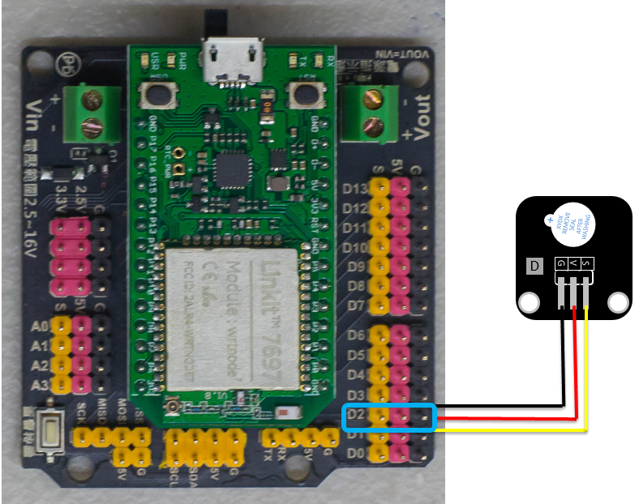
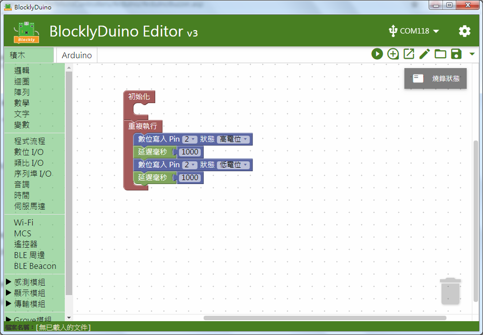

# 有源蜂鳴器模組

## 專案說明

使用「LinkIt 7697 NANO Breakout」連接「有源蜂鳴器模組」, 每一秒控制有源蜂鳴器模組發出聲音和靜音 。
  
此**有源蜂鳴器模組**包含於「**Education Kit for Linkit 7697**」內 。
  
-有源蜂鳴器模組-

## 電路圖

**•**	[**LinkIt 7697**
  
](https://www.robotkingdom.com.tw/product/linkit-7697/)**•	LinkIt 7697 NANO Breakout
  
•	無源蜂鳴器模組**

**有源蜂鳴器模組**是**數位訊號**輸出， 可以接「D0 ~ D13」的 LinkIt 7697 NANO Breakout訊號端上。 本範例連接到「**D2**」。


蜂鳴器分為「有源蜂鳴器」及「無源蜂鳴器」，「有源蜂鳴器」僅能發出單一頻率的聲音；「無源蜂鳴器」可依據不同的頻率發出不同聲調的聲音。




## 積木畫布

每一秒控制有源蜂鳴器模組發出聲音和靜音。



產生出的 Arduino 程式如下：

```text
void setup()
{

  pinMode(2, OUTPUT);
}


void loop()
{
  digitalWrite(2, HIGH);
  delay(1000);
  digitalWrite(2, LOW);
  delay(1000);
}

```

