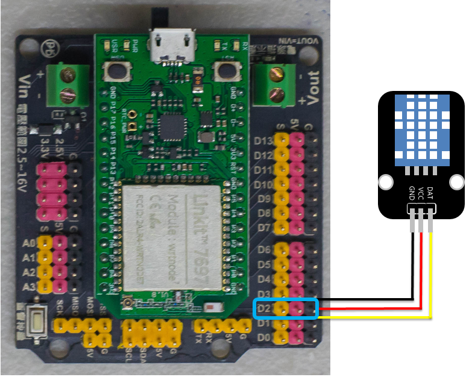
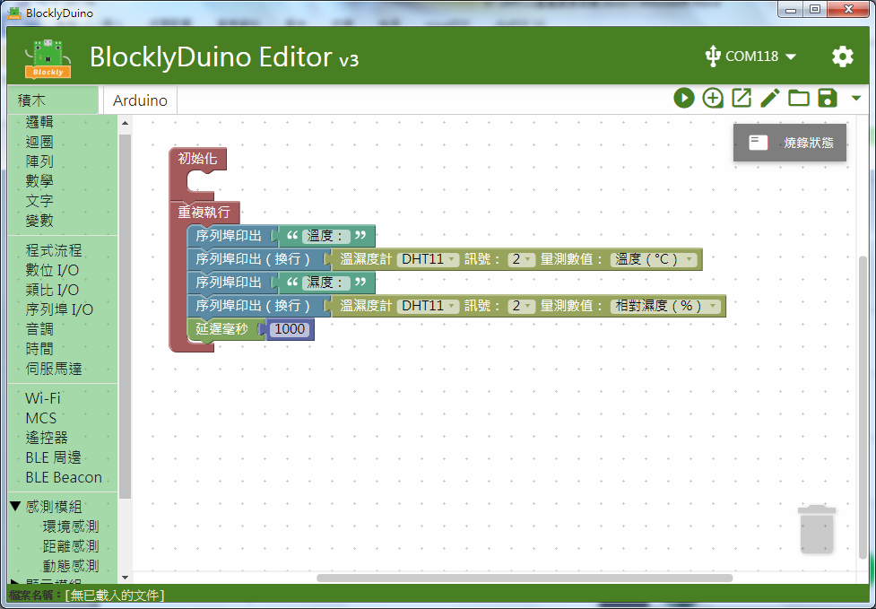
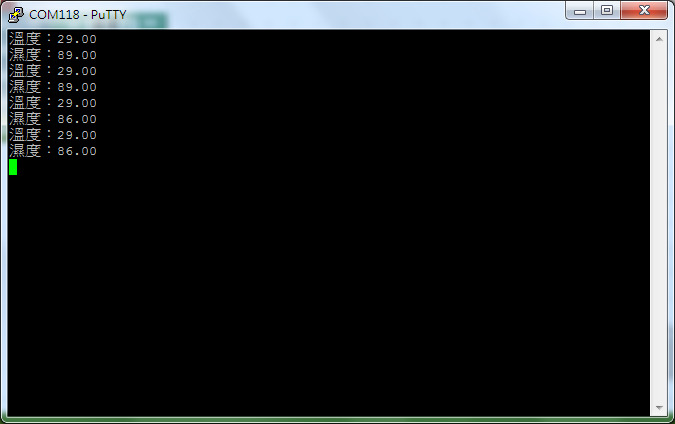

# DHT11溫溼度感測器模組

## 專案說明

使用「LinkIt 7697 NANO Breakout」連接「DHT11溫溼度感測器模組」, 每1秒讀取DHT11溫溼度感測器模組溫度和濕度數值 。
  
此**DHT11溫溼度感測器模組**包含於「**Education Kit for Linkit 7697**」內。
  
- DHT11溫溼度感測器模組圖-

## 電路圖

**•**	[**LinkIt 7697**
  
](https://www.robotkingdom.com.tw/product/linkit-7697/)**•	LinkIt 7697 NANO Breakout
  
•	DHT11溫溼度感測器模組**

**DHT11溫溼度感測器模組**是**數位訊號**輸出， 可以接「D2」的 LinkIt 7697 NANO Breakout訊號端上。 本範例連接到「**D2**」。



## 積木畫布

每秒鐘讀取DHT溫溼度感測器的溫度和濕度一次，並顯示在序列埠監控視窗上。





產生出的 Arduino 程式如下：

```text
#include <DHT.h>

DHT dht11_p2(2, DHT11);

void setup()
{

  Serial.begin(9600);

  dht11_p2.begin();
}


void loop()
{
  Serial.print("溫度：");
  Serial.println(dht11_p2.readTemperature());
  Serial.print("濕度：");
  Serial.println(dht11_p2.readHumidity());
  delay(1000);
}

```

