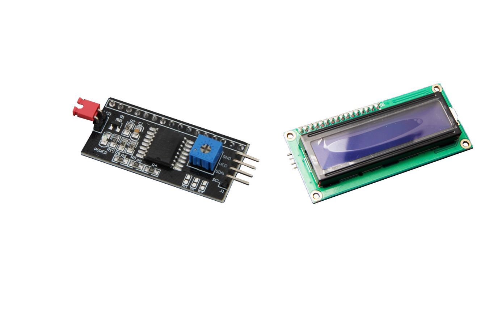
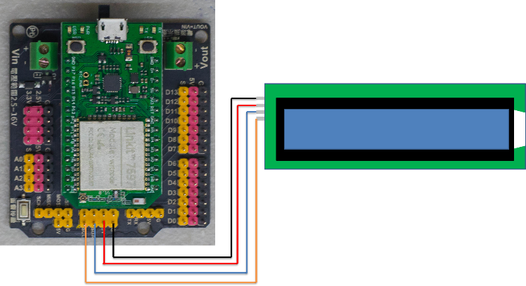
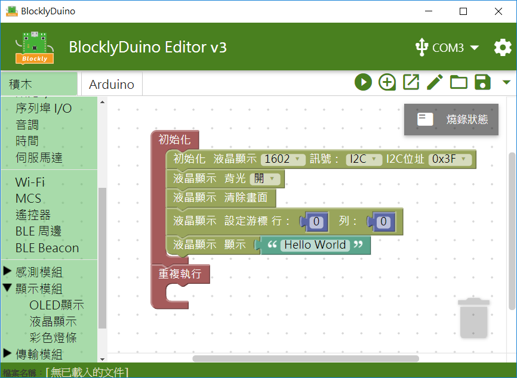
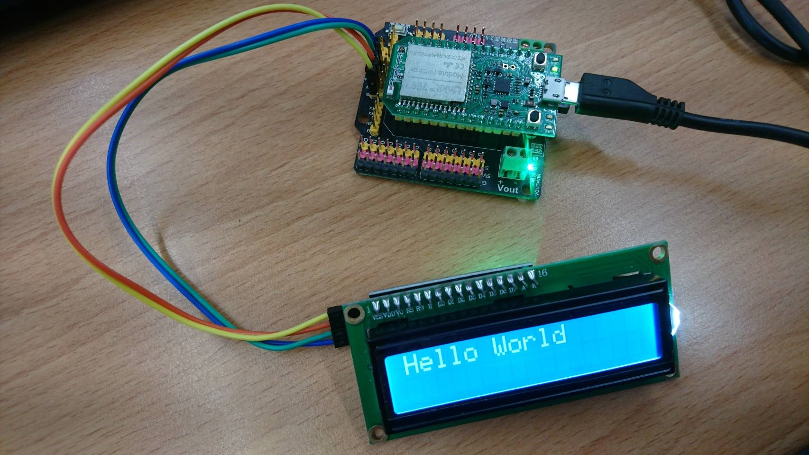

# I2C 1602液晶顯示模組



## 專案說明

使用「LinkIt 7697 NANO Breakout」連接「I2C 1602液晶顯示模組」，在I2C 1602 液晶顯示模組上顯示「Hello World」。
  
此**I2C 1602液晶顯示模組**包含於「[**洞洞么教學材料包**](https://www.robotkingdom.com.tw/product/rk-education-kit-001/) 」內。

## LinkIt 7697 電路圖

**•**	[**LinkIt 7697**
  
](https://www.robotkingdom.com.tw/product/linkit-7697/)**•	LinkIt 7697 NANO Breakout
  
•	I2C 1602液晶顯示模組**

**I2C 1602液晶顯示模組**是**I2C訊號**輸出， 可以接「I2C」的 LinkIt 7697 NANO Breakout訊號端上。 本範例連接到「**I2C**」，「**SDA**」**←→**「**SDA**」，「**SCL**」**←→**「**SCL**」。


I2C 液晶顯示模組有PCF8574及PCF8574A這二種晶片，而其中PCF8574晶片初始化I2C位址為0x27；PCF8574A晶片初始化I2C位址為0x3F。




## BlocklyDuino 積木畫布

在I2C 1602液晶顯示模組上顯示「Hello World」。





## Arduino 程式

```text

#include <LiquidCrystal_I2C.h>
LiquidCrystal_I2C lcd_i2c(0x3F);

void setup()
{
  lcd_i2c.begin(16, 2);
  lcd_i2c.backlight();
  lcd_i2c.clear();
  lcd_i2c.setCursor(0,0);
  lcd_i2c.print("Hello World");
}


void loop()
{

}

```

