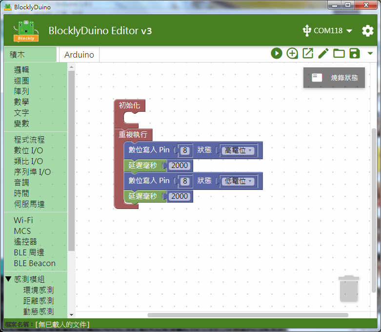

# LED模組

## 專案說明

使用「LinkIt 7697 NANO Breakout」連接「LED模組」, 每四秒鐘LED模組閃爍一次。 此**LED模組**包含於「**Education Kit for Linkit 7697**」內。  
-LED模組圖-

## 電路圖

**•**	[**LinkIt 7697**
  
](https://www.robotkingdom.com.tw/product/linkit-7697/)**•	LinkIt 7697 NANO Breakout
  
•	LED模組**

**LED模組**是**數位/類比訊號**輸出， 可以接「D0 ~ D13」的 LinkIt 7697 NANO Breakout訊號端上。 本範例連接到「**D8**」。

## 積木畫布

將8號腳位的電位拉低、拉高，每兩秒鐘會切換LED的亮暗一次。 

