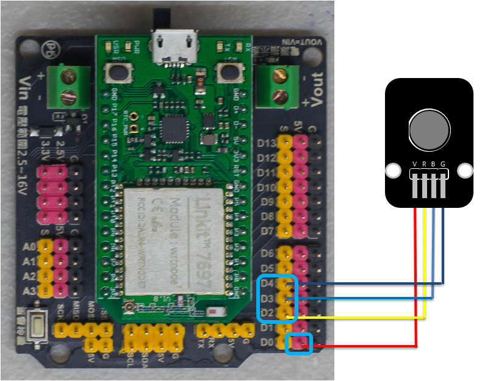
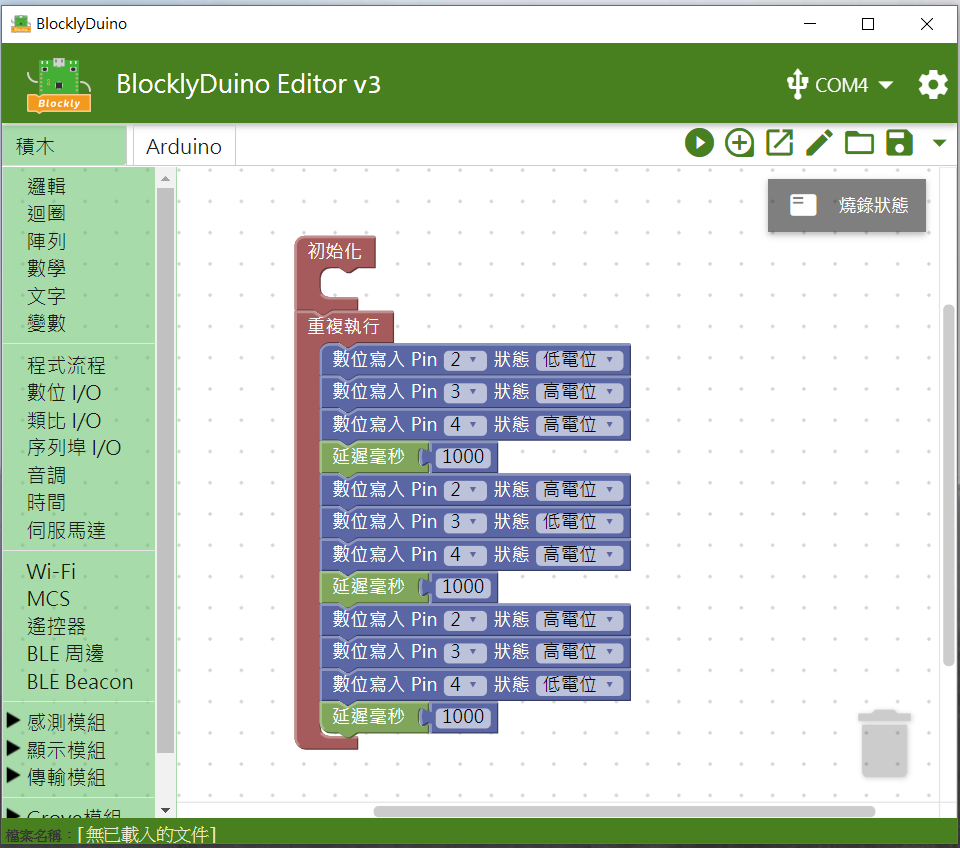

# LED模組（三色）

## 專案說明

使用「LinkIt 7697 NANO Breakout」連接「LED模組\(三色\)」,控制LED模組\(三色\) 每0.5秒依序發出紅光、綠光和藍光。
  
此**LED模組\(三色\)**包含於「**Education Kit for Linkit 7697**」內。
  
-LED模組圖-

## 電路圖

**•**	[**LinkIt 7697**](https://www.robotkingdom.com.tw/product/linkit-7697/)
  
**•	LinkIt 7697 NANO Breakout
  
•	LED模組\(三色\)**

**LED模組\(三色\)**是**數位/類比訊號**輸出， 可以接「D0 ~ D13」的 LinkIt 7697 NANO Breakout訊號端上。 此範例使用的 LED模組\(三色\) 為共陽極 LED， 由下圖 把腳位V 接到 3.3V ~ 5V 的電源， 腳位 R / B / G （Red／Blue／Green）接到數位輸出腳位。


當 R / B / G 的腳位拉高到 3.3V/5V, 電流就不會流過, LED 就不會點亮
。  
當 R / B / G 的腳位拉低， 電流就會流過。 LED 就會點亮，本範例R / B / G連接到「**D2、D3、D4**」
。



## 積木畫布

透過控制數位腳位的高低電位來使 RBG 三色亮或暗。 此範例使用的是共陽極的 RGB 全彩 LED， 所以該顏色（R / B / G）對應的腳位（D2／D3／D4）為低電位狀態時， 電流才會流過並發亮。



產生出的 Arduino 程式如下：

```text
/*
 * Generated using BlocklyDuino:
 *
 * https://github.com/MediaTek-Labs/BlocklyDuino-for-LinkIt
 *
 * Date: Mon, 08 Apr 2019 08:35:56 GMT
 */


void setup()
{

  pinMode(2, OUTPUT);
  pinMode(3, OUTPUT);
  pinMode(4, OUTPUT);
}


void loop()
{
  digitalWrite(2, LOW);
  digitalWrite(3, HIGH);
  digitalWrite(4, HIGH);
  delay(1000);
  digitalWrite(2, HIGH);
  digitalWrite(3, LOW);
  digitalWrite(4, HIGH);
  delay(1000);
  digitalWrite(2, HIGH);
  digitalWrite(3, HIGH);
  digitalWrite(4, LOW);
  delay(1000);
}

```

