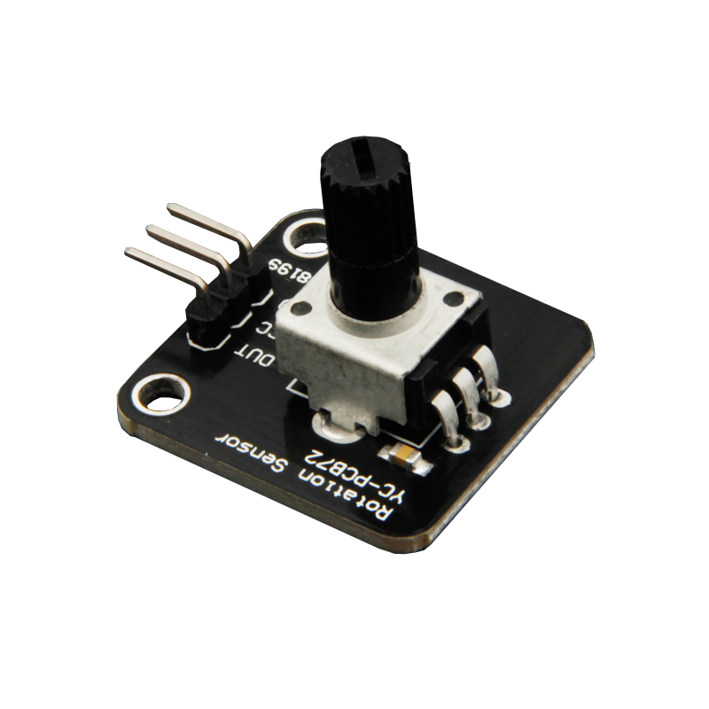
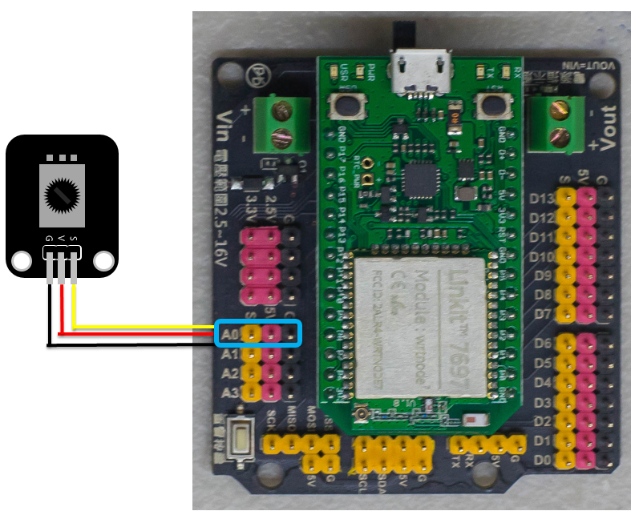
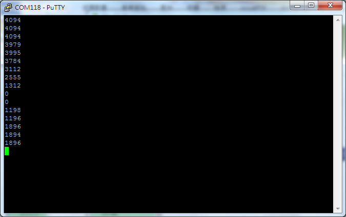

# 旋轉電位計模組



## 專案說明

使用「LinkIt 7697 NANO Breakout」連接「旋轉電位計模組」， 讀取旋轉電位計模組的數值變化 。
  
此**旋轉電位計模組**包含於「**Education Kit for Linkit 7697**」內。

## 電路圖

**•**	[**LinkIt 7697**
  
](https://www.robotkingdom.com.tw/product/linkit-7697/)**•	LinkIt 7697 NANO Breakout
  
•	旋轉電位計模組**

**旋轉電位計模組**是**類比訊號**讀取， 可以接「A0 ~ A3」的 LinkIt 7697 NANO Breakout訊號端上，「A0 ~ A3」在程式代表「14 ~ 17」。 本範例連接到「**A0**」。



## 積木畫布

每0.5秒鐘會讀取旋轉電位計模組的電位一次， 並顯示在序列埠監控視窗上。




產生出的 Arduino 程式如下：

```text
void setup()
{

  Serial.begin(9600);

}


void loop()
{
  Serial.println(analogRead(14));
  delay(500);
}

```

