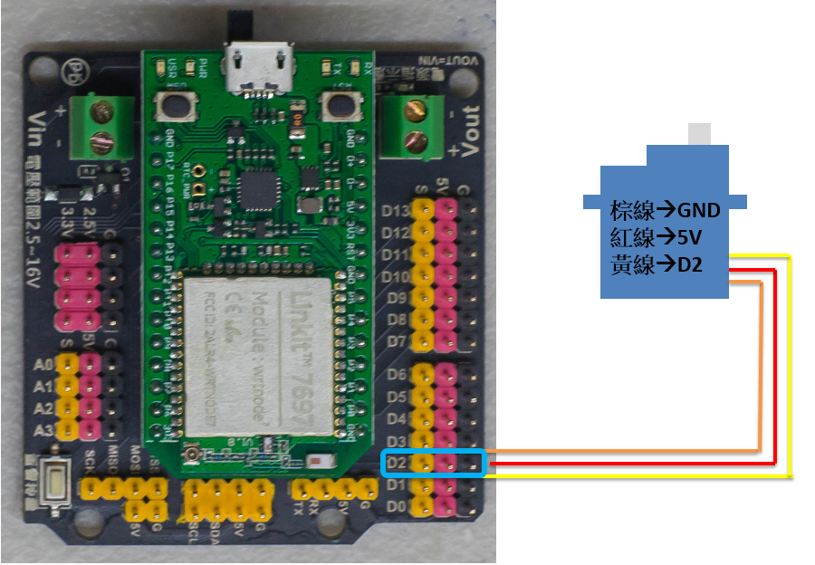
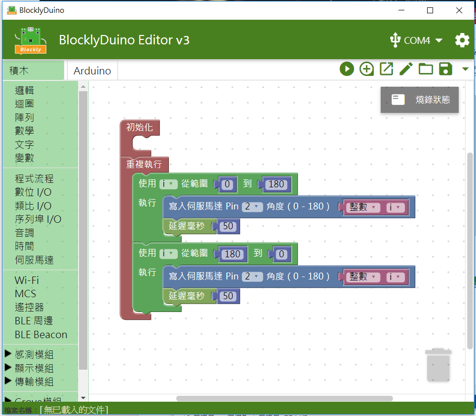

# 伺服機


## 專案說明

使用「LinkIt 7697 NANO Breakout」連接「伺服機」，控制伺服機順時針轉和逆時針轉。
  
此**伺服機**包含於「[**洞洞么教學材料包**](https://www.robotkingdom.com.tw/product/rk-education-kit-001/) 」內。

## LinkIt 7697 電路圖

**•**	[**LinkIt 7697**
  
](https://www.robotkingdom.com.tw/product/linkit-7697/)**•	LinkIt 7697 NANO Breakout
  
•	伺服機**

**伺服機**是**脈衝寬度調變\(Pulse Width Modulation\)訊號**輸出， 可以接「D0 ~ D13」的 LinkIt 7697 NANO Breakout訊號端上。 本範例連接到「**D2**」。



## BlocklyDuino 積木畫布

控制伺服機順時針旋轉及逆時旋轉。



## Arduino 程式

```text
#include <Servo.h>

int i;

Servo __myservo2;

void setup()
{

  __myservo2.attach(2);
}


void loop()
{
  for (i = 0; i <= 180; i++) {
    __myservo2.write(i);
    delay(50);
  }
  for (i = 180; i >= 0; i--) {
    __myservo2.write(i);
    delay(50);
  }
}

```


