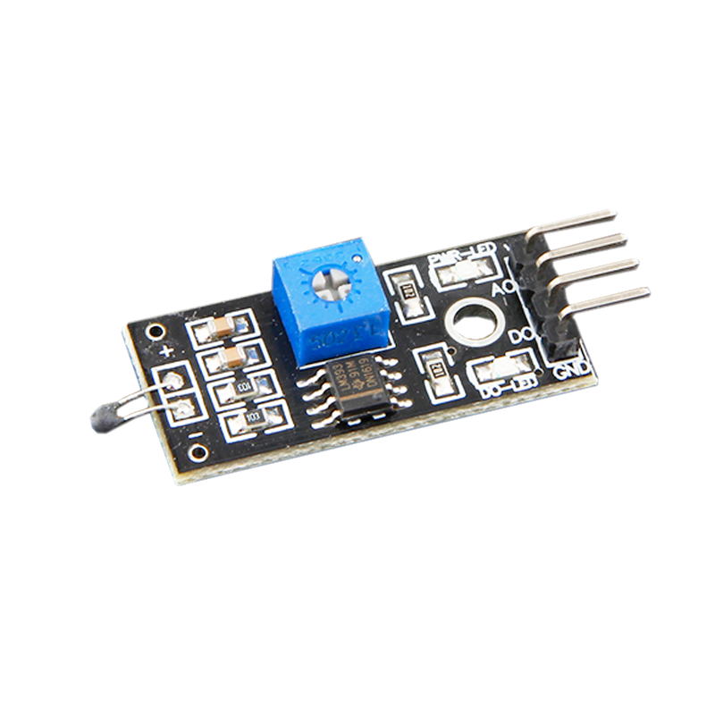
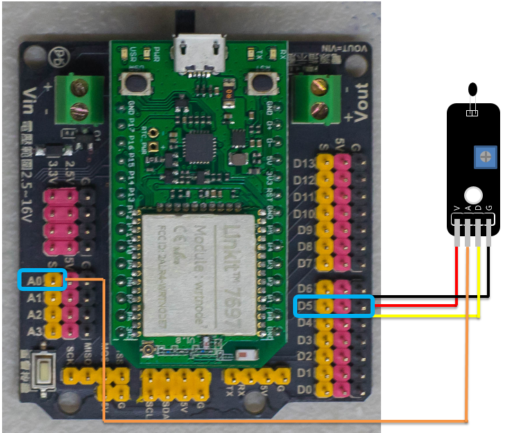
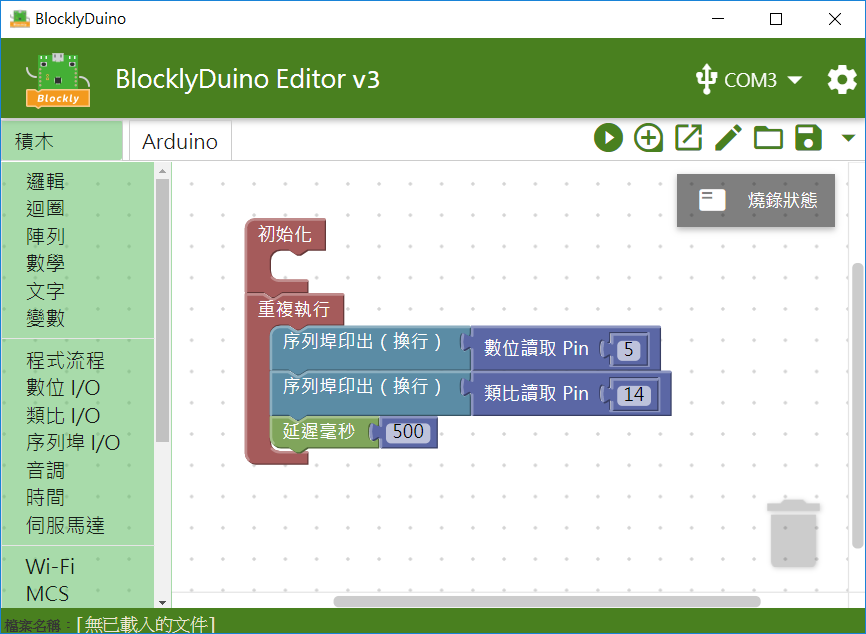
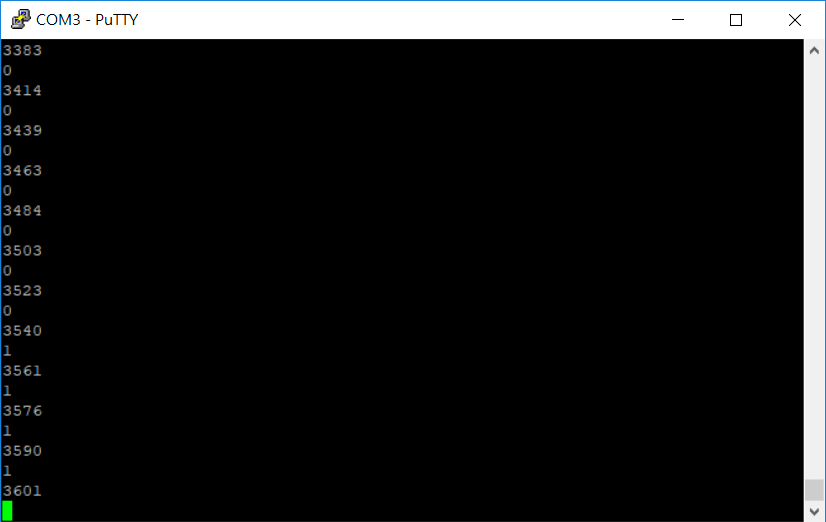

# 熱敏（溫度）模組



## 專案說明

使用「LinkIt 7697 NANO Breakout」連接「熱敏（溫度）模組」, 每0.5秒讀取熱敏（溫度）模組的溫度訊號比例。
  
此**熱敏（溫度）模組**包含於「**Education Kit for Linkit 7697**」內。

## 電路圖

**•**	[**LinkIt 7697**
  
](https://www.robotkingdom.com.tw/product/linkit-7697/)**•	LinkIt 7697 NANO Breakout
  
•	熱敏（溫度）模組**

**熱敏（溫度）模組**是**數位/類比訊號**輸出， 可以接「D0 ~ D13、A0~A3」的 LinkIt 7697 NANO Breakout訊號端上。 本範例連接到「**D5**」、「**A0**」。



## 積木畫布

每0.5秒鐘讀取熱敏（溫度）模組溫度的類比及數位資訊一次 。





產生出的 Arduino 程式如下：

```text

void setup()
{

  pinMode(5, INPUT);
  Serial.begin(9600);

}


void loop()
{
  Serial.println(digitalRead(5));
  Serial.println(analogRead(14));
  delay(500);
}

```

