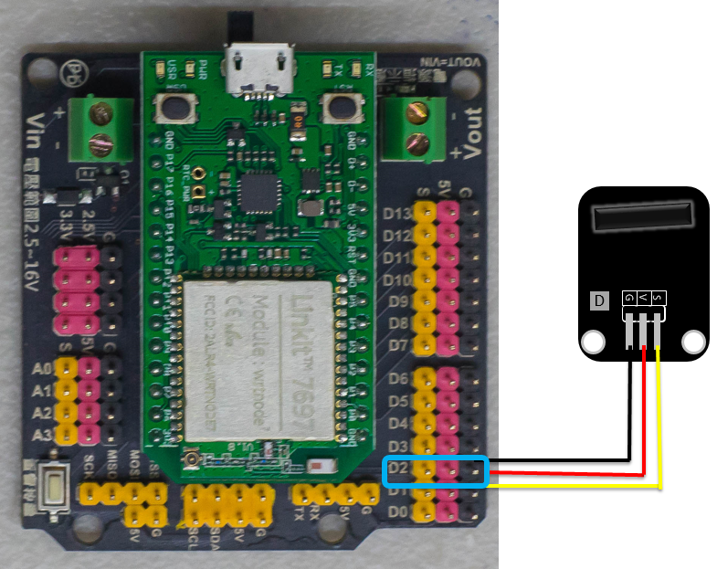
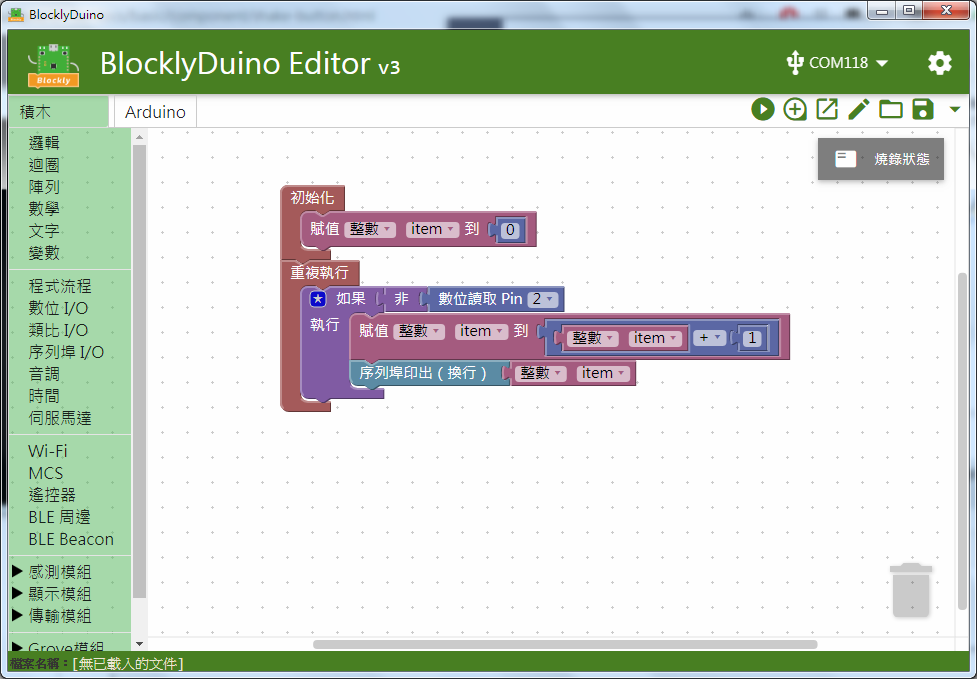
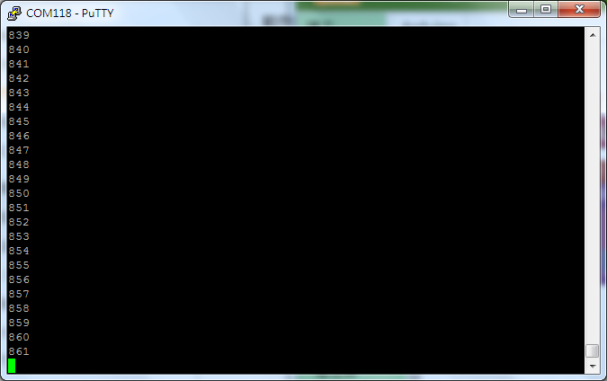

# 震動開關模組

## 專案說明

使用「LinkIt 7697 NANO Breakout」連接「震動開關模組」, 紀錄震動次數。
  
此**震動開關模組**包含於「**Education Kit for Linkit 7697**」內。
  
-震動開關模組圖-

## 電路圖

**•**	[**LinkIt 7697**
  
](https://www.robotkingdom.com.tw/product/linkit-7697/)**•	LinkIt 7697 NANO Breakout
  
•	震動開關模組**

**震動開關模組**是**數位訊號**讀取， 可以接「D0 ~ D13」的 LinkIt 7697 NANO Breakout訊號端上。 本範例連接到「**D2**」。



## 積木畫布

計算震動開關模組目前累計震動次數。





產生出的 Arduino 程式如下：

```text

int item;

void setup()
{
  item = 0;
  pinMode(2, INPUT);
  Serial.begin(9600);

}


void loop()
{
  if (!digitalRead(2)) {
    item = item + 1;
    Serial.println(item);

  }
}

```

