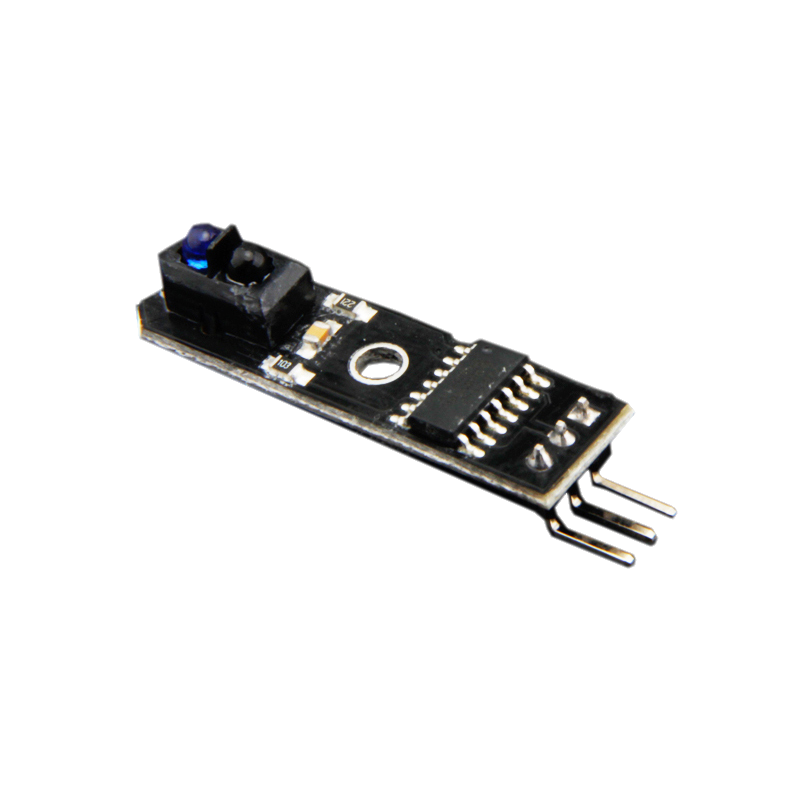
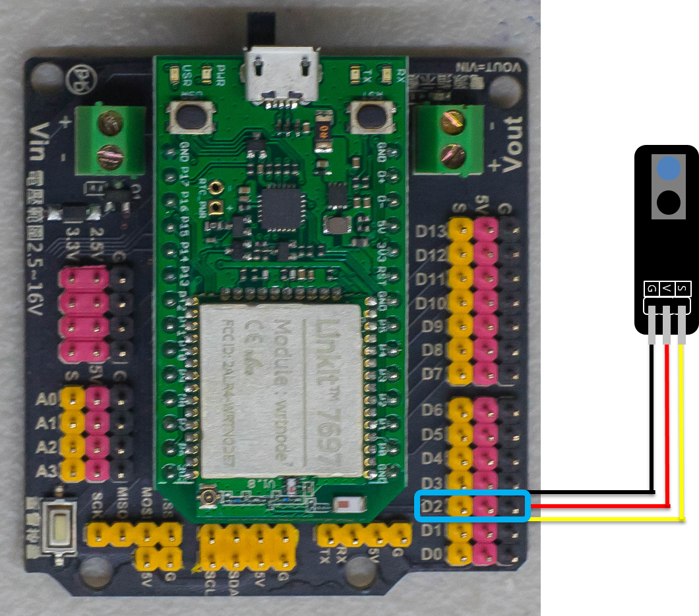
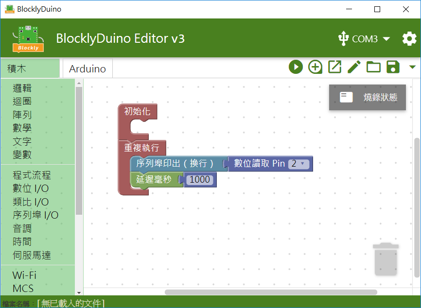
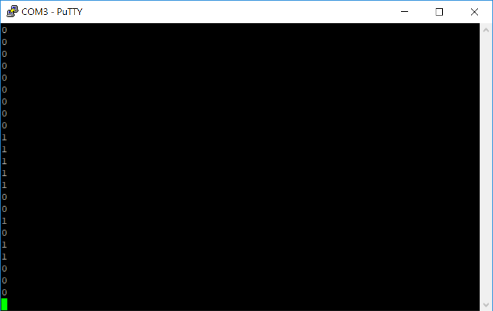

# 紅外線偵測模組



## 專案說明

使用「LinkIt 7697 NANO Breakout」連接「紅外線偵測模組」， 每秒讀取紅外線偵測模組偵測到白線或黑線。
  
此**紅外線偵測模組**包含於「[**洞洞么教學材料包**](https://www.robotkingdom.com.tw/product/rk-education-kit-001/) 」內。

## LinkIt 7697 電路圖

**•**	[**LinkIt 7697**
  
](https://www.robotkingdom.com.tw/product/linkit-7697/)**•	LinkIt 7697 NANO Breakout
  
•	紅外線偵測模組**

**紅外線偵測模組**是**數位訊號**輸入， 可以接「D0 ~ D13」的 LinkIt 7697 NANO Breakout訊號端上。 本範例連接到「**D2**」。


紅外線偵測模組是利用光線對顏色不同的反射率， 判斷感測器的輸入端是0或者是1，進而判斷是黑線或是白線。




## BlocklyDuino 積木畫布

每秒鐘讀取紅外線偵測模組偵測白線或黑線一次 ，並顯示在序列埠監控視窗上。





## Arduino 程式

```text
void setup()
{

  pinMode(2, INPUT);
  Serial.begin(9600);

}


void loop()
{
  Serial.println(digitalRead(2));
  delay(1000);
}

```

