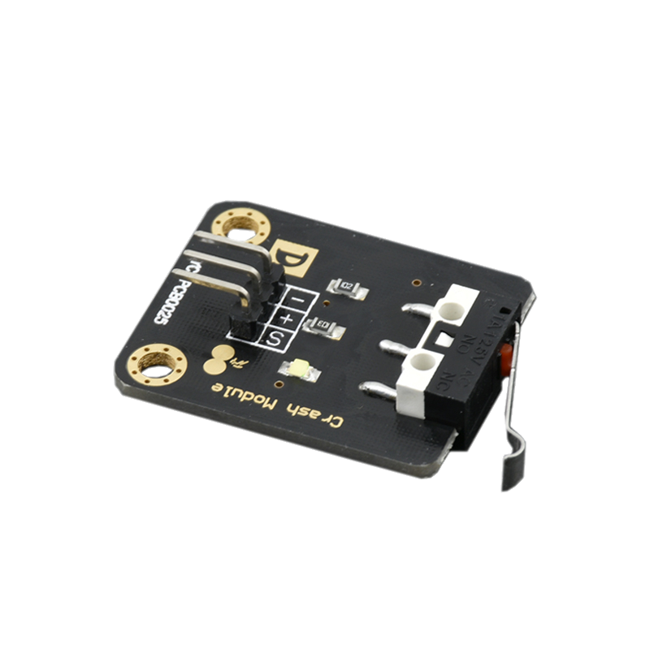
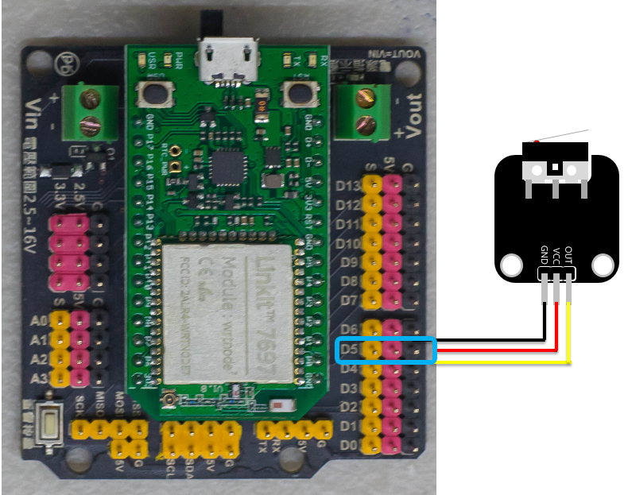
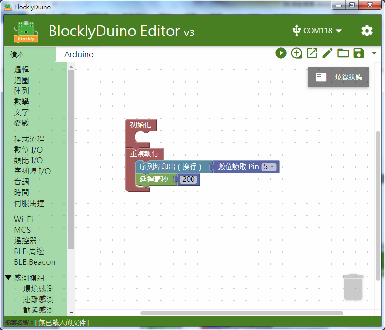
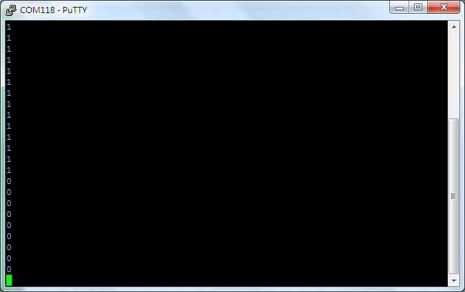

# 微動開關模組



## 專案說明

使用「LinkIt 7697 NANO Breakout」連接「微動開關模組」,，每0.2秒讀取微動開關模組按下和放開。
  
此**微動開關模組**包含於「[**洞洞么教學材料包**](https://www.robotkingdom.com.tw/product/rk-education-kit-001/) 」內。

## LinkIt 7697 電路圖

**•**	[**LinkIt 7697**
  
](https://www.robotkingdom.com.tw/product/linkit-7697/)**•	LinkIt 7697 NANO Breakout
  
•	微動開關模組**

**微動開關模組**是**數位訊號**輸入， 可以接「D0 ~ D13」的 LinkIt 7697 NANO Breakout訊號端上，「A0 ~ A3」在程式代表「14 ~ 17」。 本範例連接到「**D5**」。



## BlocklyDuino 積木畫布

每0.2秒鐘會讀取微動開關模組的開啟或關閉一次， 並顯示在序列埠監控視窗上。





## Arduino 程式

```text
void setup()
{

  pinMode(5, INPUT);
  Serial.begin(9600);

}


void loop()
{
  Serial.println(digitalRead(5));
  delay(200);
}

```


