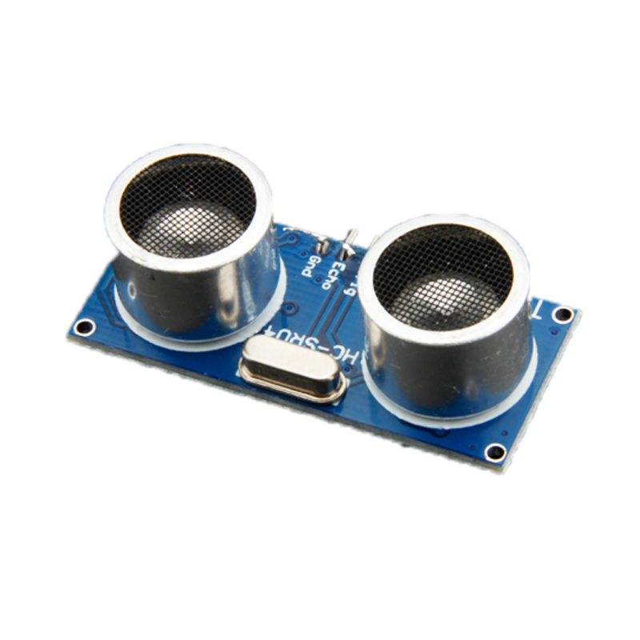
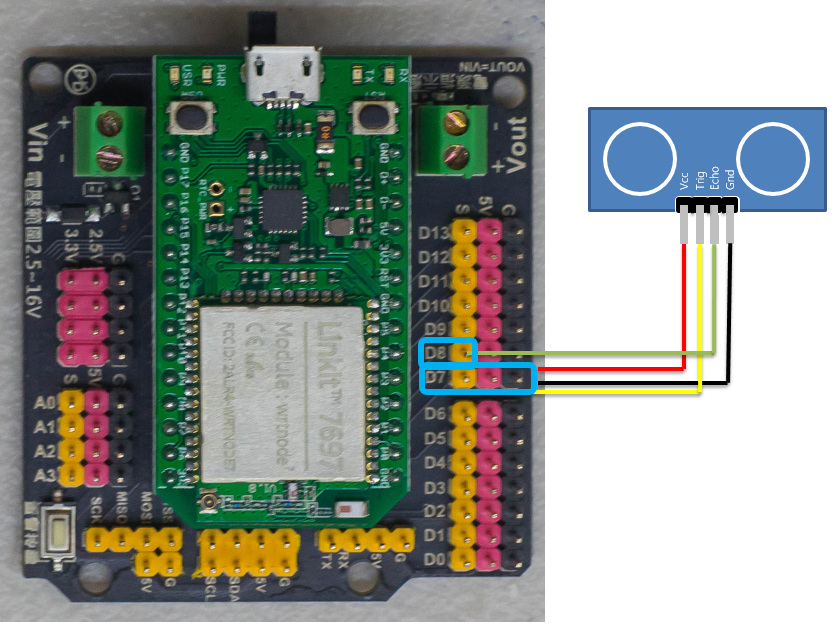
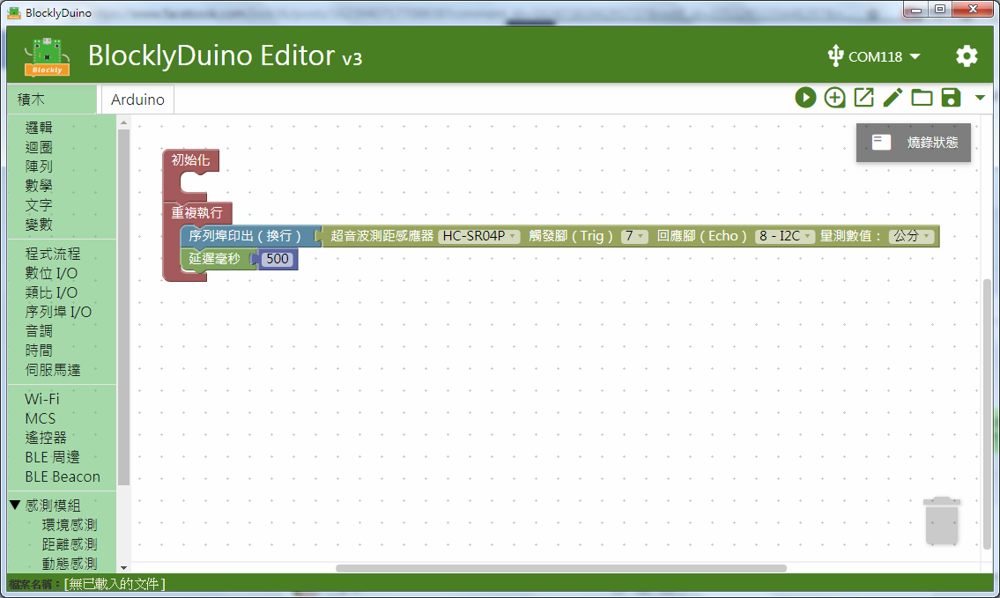
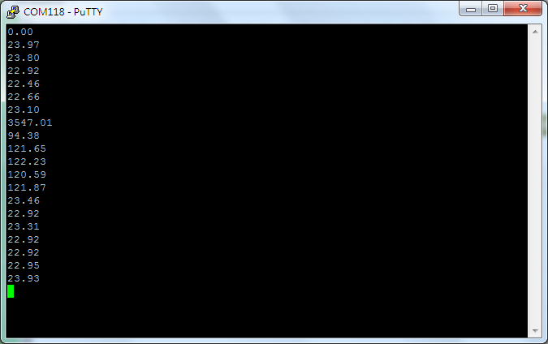

# 超音波測距感測器



## 專案說明

使用「LinkIt 7697 NANO Breakout」連接「超音波測距感測器」， 每0.5秒讀取超音波測距感測器所測到的距離。
  
此**超音波測距感測器**包含於「[**洞洞么教學材料包**](https://www.robotkingdom.com.tw/product/rk-education-kit-001/) 」內。

## LinkIt 7697 電路圖

**•**	[**LinkIt 7697**
  
](https://www.robotkingdom.com.tw/product/linkit-7697/)**•	LinkIt 7697 NANO Breakout
  
•	超音波測距感測器**

**超音波測距感測器**是**類比訊號**輸出， 可以接「D0 ~ D13」的 LinkIt 7697 NANO Breakout訊號端上。 本範例連接到「**D7**」、「**D8**」 。


超音波測距感測器是由發射器、接收器以及控制電路所組成，若待測物體距離太遠，或者發射器、接收器其中一個被遮蔽，皆會導致量測距離結果錯誤。




## BlocklyDuino 積木畫布

每0.5秒鐘會讀取一次超音波測距感測器所測得的距離。





## Arduino 程式

```text
#include <Ultrasonic.h>

Ultrasonic ultrasonic_7_8(7, 8);

void setup()
{

  Serial.begin(9600);

}


void loop()
{
  Serial.println(ultrasonic_7_8.convert(ultrasonic_7_8.timing(), Ultrasonic::CM));
  delay(500);
}

```

